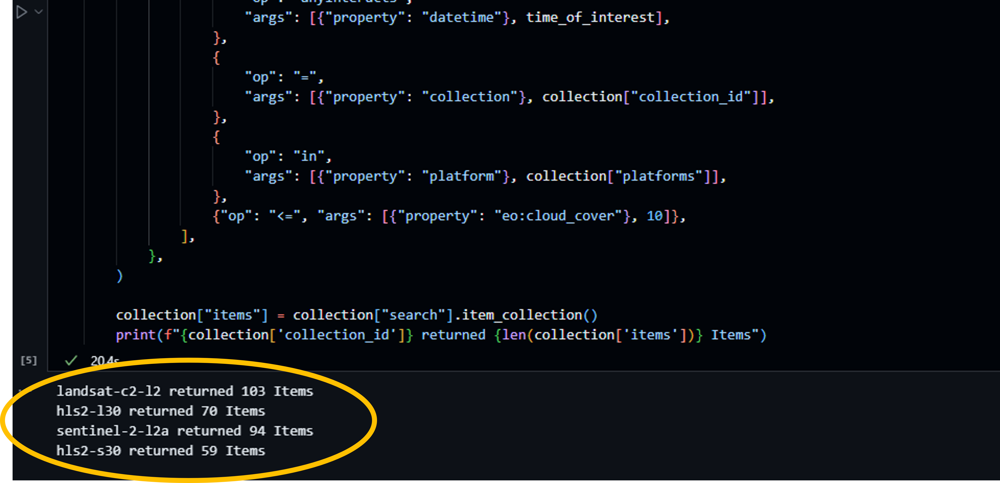
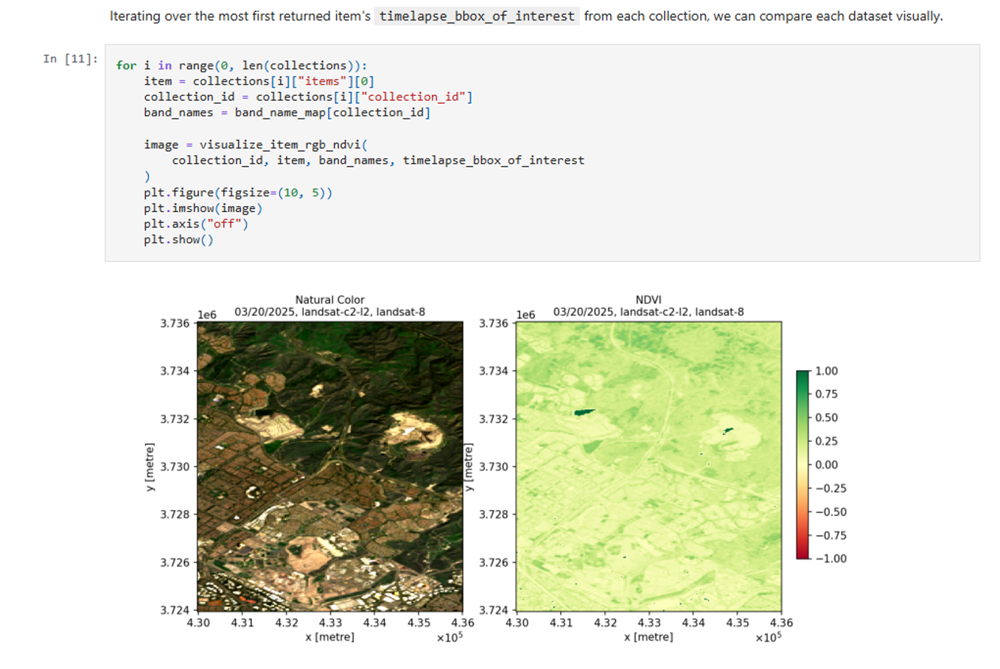

# Exploring NASA’s HLS Data on Microsoft Planetary Computer Using GitHub Copilot

Use AI to query, visualize, and interact with NASA’s HLS data available in Microsoft's Planetary Computer

## Description
This tutorial introduces users to NASA’s Harmonized Landsat and Sentinel-2 (HLS) data through Microsoft’s Planetary Computer, using GitHub Copilot as a coding and AI assistant. The objective is to guide participants in interacting with the HLS Jupyter notebook, demonstrating how GitHub Copilot can simplify coding tasks, accelerate data exploration, promote open science, and increase accessibility through natural language prompts. By the end, users will be able to query, visualize, and analyze HLS data while gaining hands-on experience with AI-assisted development.

## Objectives
- Access HLS data from Microsoft’s Planetary Computer 
- Extract and visualize HLS data from an area and time of interest 
- Use GitHub Copilot to explore HLS data and modify code using natural language prompts
- Generate an HLS-derived Normalized Difference Vegetation Index (NVID) plot and timelapse HLS gif

## Prerequisites:
1.  Basic knowledge of Python and command-line usage
2.	Access to Microsoft Planetary Computer repository (https://github.com/microsoft/PlanetaryComputerExamples)
3.	GitHub account with Codespaces enabled (https://github.com/signup; https://github.com/settings/codespaces)
4.	GitHub Copilot (https://docs.github.com/en/copilot/get-started/plans)

## Tutorial

### 1. Setup your Environment

1.  Go to the Microsoft repo: https://github.com/microsoft/PlanetaryComputerExamples
2.	In the top-right corner, click **Fork**.
3.	Choose your account


Now you have your own copy under https://github.com/your-username/PlanetaryComputerExamples.

4.	In your fork, click the green **Code** button → **Open with Codespaces**
5.	Click **Create codespace on main**.


A cloud dev environment will spin up.  Wait a few minutes to finish loading.

6.	In the left-hand Explorer sidebar, expand: **datasets → hls2 → hls2-example.ipynb**
7.	Click on the notebook to open it.
8.	If asked to select a kernel, pick the **default Python (e.g., “Python 3.x (Codespaces)”)**.


In this section, you prepared your environment by forking the Microsoft Planetary Computer Examples repository, opening it in GitHub Codespaces, and launching the HLS2 notebook. With this setup complete, you’re ready to test the notebook and start exploring HLS data.

### 2. Test the Notebook
1.  At the top of the notebook, add a new cell.
2.	Copy and run this code:

```bash
%pip install -q pystac-client planetary-computer xarray rioxarray matplotlib geopandas folium rich odc-stac imageio pillow imageio-ffmpeg
```

3. When it finishes, click **Restart → Restart Kernel** so everything reloads with the new packages.
4. Edit this cell starting with _import pystac_client_, and add:
   
```bash
print("✅ Imports successful")
```
5.  Run the cell

If you see ✅ Imports successful, everything is installed correctly.

6. Now, modify the next cell in the Notebook to check connection with the Planetary Computer STAC:
   
```bash
print("STAC OK:", catalog is not None)
```
7. Run the cell.

If output is STAC OK: True, this confirms your notebook can talk to the Microsoft Planetary Computer catalog.

8.	Run the cells under the **Choose a region and time of interest** section in the notebook.
9.	The last cell should have HLS2 items returned, meaning you can fetch HLS data from the Microsoft Planetary Computer.



In this section, you have checked that your environment works, verified that your notebook can talk to the Microsoft Planetary Computer and can access HLS data.

Scroll through the rest of the notebook to inspect it.  Do you see the area and time of interest?  The NVDI plots?  The visualizations from satellite imagery?  We will use AI in the next section to dive deeper into these and modify the code, all using natural language commands.



### 3. Use GitHub Copilot

In this section, you’ll use GitHub Copilot, an AI coding assistant that suggests code, explains cells, and helps you adapt the your tools through natural language commands. We’ll walk through how to prompt Copilot to explain the notebook, customize searches, create visualizations, and perform simple analyses like NDVI.

1.  Open the Copilot Chat sidebar (icon on the top right)
2.	GitHub Copilot will open on the right-side of your window
3.	Set Copilot to Ask mode, and select a model like GPT-4o.


Feel free to experiment with other models like GPT-5-mini, Claude, or others to see differences in Copilot engagement and responses.

4.	Ask Copilot, type:
   
```bash
"Explain what this notebook does at a high level”
```

Copilot will summarize how the notebook connects to the Planetary Computer, searches HLS data, and plots results.


Try other prompts to explore the notebook further:

```bash
"I’m new to HLS data, what can you tell me about it"
"What is NDVI?  Give me its definition and formula"
```

Now we will use Copilot in Agent mode to modify the code.  

Please note that the default notebook focuses on Orange County, California and calculates the Normalized Vegetation Index (NDVI) in this area from October 2022 to April 2025.  We will use Copilot to change the code to a different region and time of interest.

5. Click the cell with the area of iterest.
6. Click , which will open Copilot inside the notebook to allow us to modify the code.
7. Type the following prompt:

```bash
“Please replace the area of interest from Orange County, California to Washington D.C.  Comment out the original code and insert the new code below"
```


Copilot will insert a new cell with the updated coordinates for Washington D.C.


Feel free to experiment with other areas around the world.

Now we will do a similar process to change the timeline.

8. Locate the Time of Interest cell.
9. Click , to open Copilot inside the notebook.
10. Type the following prompt:

```bash
“Please update the time of interest to be between April 2023 to January 2025"
```


11. Click the **Run All** button, to run the entire notebook with the new area and time of interest.

See that the NVDI plot and visualizations represent Washington D.C. 


Can you see the Potomac River?

In this section, you used GitHub Copilot to go beyond simply running the notebook by turning it into an interactive learning experience. Copilot explained what the code was doing, helped you customize searches for new locations and dates, and generated code to visualize HLS data as RGB composites and NDVI maps. You also learned how to save your results and commit your work back to your GitHub fork, building a complete workflow from exploration to analysis to sharing.

## Additional Prompts for Copilot:

GitHub Copilot makes it easy to edit code.  Here are a few additional prompts you can test in other parts of the notebook to explore what you can do with HLS data:

🔍 Explore More Data
- “Change the search to look at Los Angeles, California for August 2022 .”
- “Search for HLS scenes over the Amazon rainforest in June 2021 with less than 20% cloud cover.”

🖼️ Advanced Visualization
- “Plot the Near Infrared (B08), Red (B04), and Green (B03) bands as a false-color composite to highlight vegetation.”
- “Overlay the RGB image on top of the item’s footprint polygon with GeoPandas.”

🌱 Deeper Analysis
- “Compute EVI (Enhanced Vegetation Index) using the Blue, Red, and NIR bands and plot it.”
- “Calculate the average NDVI across the entire image and print the value.”
- “Generate an NDVI histogram to see the distribution of values.”

📈 Time Series
- “Loop through all items in the search results and plot NDVI over time as a line chart.”
- “Make a small animation (GIF) of RGB composites over multiple dates to show change.”

🗺️ Mapping
- “Put the RGB composite on an interactive Folium map centered on the search area.”
- “Add NDVI as a semi-transparent layer on the Folium map with a legend.”

💾 Saving Results
- “Save the RGB composite as a PNG file.”
- “Export NDVI as a GeoTIFF with CRS and metadata preserved.”


## Resources:
- Learn more about Microsoft Planetary Computer: https://planetarycomputer.microsoft.com/
- For more information on NASA's HLS data: https://www.earthdata.nasa.gov/data/projects/hls
- Continue learning about GitHub Copilot: https://learn.microsoft.com/en-us/training/modules/introduction-to-github-copilot/


